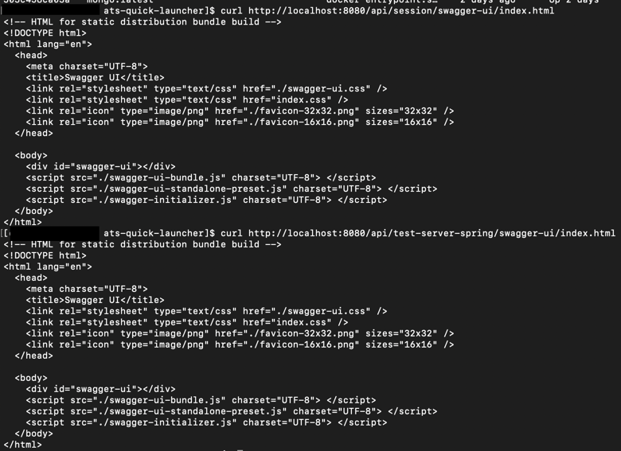

# ats-quick-launcher
한큐에 AikusoniTradeSystem 앱을 배포할 때 사용

### 개요
- Docker Compose를 사용해 한번에 앱을 배포 할 수 있다.

### 사용법
1. 이 레포지토리를 클론한다.
```sh
$ git clone https://github.com/AikusoniTradeSystem/ats-quick-launcher.git
```

2. 프로젝트 루트에 쉘 스크립트를 만든다. \
이 쉘 스크립트는 필요한 환경변수를 설정하고 도커 컴포즈를 올리는 역할을 한다.
> 다음은 예시 스크립트
```sh
$ vi ats_start.sh

#!/bin/bash

(
  # host environment variables
  export NGINX_LOG_HOME=/home/ats/logs/nginx
  export TEST_SERVER_SPRING_LOG_HOME=/home/ats/logs/test-server-spring
  export SESSION_AUTH_SERVER_LOG_HOME=/home/ats/logs/session-auth-server
  export PG_DATA=/home/ats/pg_data
  
  # You can add more environment variables here (See docker-compose.yml)

  # run docker compose
  docker compose pull
  docker compose up -d
  
  # If you want to use dev image, use the following command
  # docker compose -f docker-compose.dev.yml up -d 
)
```

3. 작성한 쉘 스크립트를 실행한다.
```sh
# If you have permission issues, you may need to use sudo.
$ chmod +x ats_start.sh
$ ./ats_start.sh
```

### 확인
- 다음과 같이 curl로 페이지를 호출해보거나, 웹 브라우저로 페이지를 열면 서버가 정상 작동 중인 것을 확인 할 수 있습니다. 
```sh
$ curl http://localhost:8080/api/session/swagger-ui/index.html
$ curl http://localhost:8080/api/test-server-spring/swagger-ui/index.html
````



### 끄는 법
1. 프로젝트 루트에 쉘 스크립트를 만든다. \
이 스크립트는 환경변수를 설정하고 도커 컴포즈를 내리는 역할을 한다.
> 다음은 예시 스크립트
```sh
$ vi ats_stop.sh

#!/bin/bash
(
  docker compose down

  # If you want to use dev image, use the following command
  # docker compose -f docker-compose.dev.yml down
)
```

2. 작성한 쉘 스크립트를 실행한다.
```sh
# If you have permission issues, you may need to use sudo.
$ chmod +x ats_stop.sh
$ ./ats_stop.sh
```
