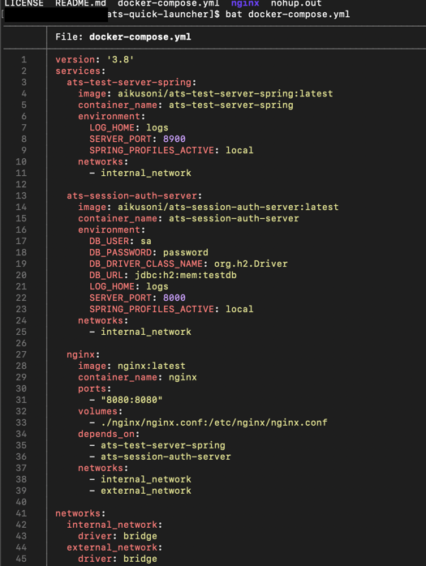

# ats-quick-launcher
한큐에 앱을 배포할 때 사용

### 개요
- Docker Compose를 사용해 한번에 앱을 배포 할 수 있다.

### 사용법
1. 이 레포지토리를 클론한다.
```sh
$ git clone https://github.com/AikusoniTradeSystem/ats-quick-launcher.git
```

2. 필요한 설정값을 입력한다. (추후 설정 저장소 적용시 변경될 예정)
```sh
$ vi docker-compose.yml
```

다음은 설정 예시입니다.


3. docker-compose를 실행한다.
```sh
# 권한 문제가 있을 수 있으니, sudo를 사용해야 할 수도 있습니다.
$ nohup docker compose up -d &
```

### 확인
- 다음과 같이 curl로 페이지를 호출해보거나, 웹 브라우저로 페이지를 열면 서버가 정상 작동 중인 것을 확인 할 수 있습니다. 
```sh
$ curl http://localhost:8080/api/session/swagger-ui/index.html
$ curl http://localhost:8080/api/test-server-spring/swagger-ui/index.html
````


### 끄는 법
```sh
# 권한 문제가 있을 수 있으니, sudo를 사용해야 할 수도 있습니다.
$ docker compose down
```
